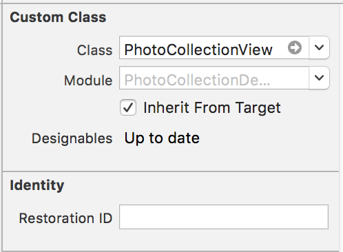

# PhotoCollectionView
Custom CollectionView like as Facebook Feed for iOS 

## Overview

<table>
  <tr>
    <th>
      
    </th>
    <th>
      
    </th>
  </tr>
</table>

## Requirements

* iOS 8.0+
* Xcode 8+
* Swift 3

## Installation

### CocoaPods

To integrate PhotoCollectionView into your Xcode project using CocoaPods, specify it in your `Podfile`:

```ruby
source 'https://github.com/CocoaPods/Specs.git'
platform :ios, '8.0'
use_frameworks!

pod 'PhotoCollectionView', '~> 1.1.1' 
```

Then, run the following command:

```bash
$ pod install
```

### Manually
- Drag and drop `PhotoCollectionView` folder into your project

## Usage

### Create PhotoCollectionView
Use can create instance of `PhotoCollectionView` by code:

```
import PhotoCollectionView
```

```
let photoCollectionView = PhotoCollectionView(frame: CGRect(x: 0, y: 0, width: 320, height: 240))
```

or create an `UIView` in storyboard and Outlet it

<table>
  <tr>
    <th>
      
    </th>
  </tr>
</table>

```
import PhotoCollectionView
```
```
@IBOutlet weak var imageCollectionView: PhotoCollectionView!
```

### PhotoCollectionViewDataSource

- Extension `PhotoCollectionViewDataSource` for binding data

```
extension ViewController: PhotoCollectionViewDataSource {
    func numPhotos(in photoCollectionView: PhotoCollectionView) -> Int {
        // Return count photo.
        return 10
    }
    
    // You can use image for data
    func photoColletionView(_ photoCollectionView: PhotoCollectionView, imageAt index: Int) -> UIImage? {
    	// return image need to show.
        return UIImage(named: "image\(index + 1)")
    }

    // or use image url
    func photoCollectionView(_ photoCollectionView: PhotoCollectionView, urlImageAt index: Int) -> URL? {
        return URL(string: *your image URL here*)
    }

}
```

- Set `dataSource` of PhotoCollectionView

```
imageCollectionView.dataSource = self
```

## Author

Luan Tran - noblakit01@gmail.com

## License
[MIT](http://thi.mit-license.org/)


